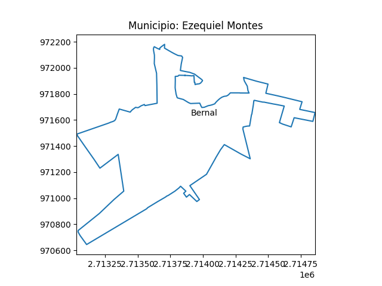

# Mapping Queretaro
Use INEGI information to plot a map from Queretaro Localities.

Detailed information from the state of Queretaro, municipalities and localities can be found here:

<https://www.inegi.org.mx/app/biblioteca/ficha.html?upc=702825218898>

The format of the information is Esri Shapefile (shp). We need the python library pyshp to analyze the information.

I followed the implementation from the following link

<https://towardsdatascience.com/mapping-geograph-data-in-python-610a963d2d7f> 

and I adapted the details to INEGI information. 

